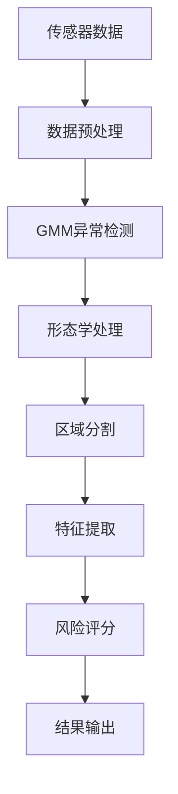

# 核心程序文件详细说明文档

## 📋 文档概述

本文档详细描述了智能医疗检测系统中每个核心程序文件的功能、结构、接口和使用方法，为开发者和维护人员提供全面的技术参考。

---

## 🎯 主程序文件

### 1. `modern_detection_gui_optimized.py` / `智能检测主程序.py`

**文件类型**: 主程序入口  
**代码行数**: ~1200行  
**主要功能**: 系统主界面和核心控制逻辑

#### 核心类和方法

```python
class ModernDetectionGUI:
    def __init__(self):
        # 初始化GUI组件和系统参数
        
    def setup_gui(self):
        # 创建主界面布局
        
    def start_detection(self):
        # 启动实时检测流程
        
    def update_display(self):
        # 更新实时显示数据
        
    def export_results(self):
        # 导出检测结果
```

#### 功能模块

1. **GUI界面管理**
   - 主窗口布局 (1400×900像素)
   - 实时数据显示面板
   - 参数配置界面
   - 结果导出功能

2. **数据可视化**
   - 12×8传感器热力图
   - 3D压力分布图
   - 实时波形显示
   - 检测结果标记

3. **串口通信管理**
   - 自动端口检测
   - 数据接收和解析
   - 通信状态监控
   - 错误处理和重连

4. **多线程处理**
   - 数据采集线程
   - 检测算法线程
   - GUI更新线程
   - 数据导出线程

#### 关键参数

```python
# 界面配置
WINDOW_WIDTH = 1400
WINDOW_HEIGHT = 900
UPDATE_INTERVAL = 50  # ms

# 检测参数
DETECTION_THRESHOLD = 0.3
MIN_AREA = 2
HIGH_RISK_THRESHOLD = 0.7

# 串口配置
BAUD_RATE = 115200
TIMEOUT = 1.0
BUFFER_SIZE = 1024
```

#### 数据流处理

1. **输入**: 串口原始数据 (二进制协议)
2. **处理**: 协议解析 → 数据预处理 → 算法检测
3. **输出**: 可视化显示 + 结果文件导出

---

### 2. `main_detection_app.py`

**文件类型**: 应用程序启动器  
**代码行数**: ~300行  
**主要功能**: 系统初始化和模块管理

#### 核心功能

```python
class MainDetectionApp:
    def __init__(self):
        # 初始化系统组件
        
    def check_dependencies(self):
        # 检查依赖库和环境
        
    def initialize_modules(self):
        # 加载和初始化各个检测模块
        
    def run_batch_analysis(self):
        # 批量数据分析功能
```

#### 系统管理功能

1. **环境检查**
   - Python版本验证
   - 依赖库完整性检查
   - 硬件设备检测
   - 配置文件验证

2. **模块加载**
   - 动态导入检测模块
   - 模型权重加载
   - 配置参数初始化
   - 错误处理和回退

3. **批处理功能**
   - 历史数据批量分析
   - 结果统计和报告生成
   - 性能基准测试
   - 数据质量评估

---

## 🔬 检测算法模块

### 3. `enhanced_detection_system.py` / `增强检测系统.py`

**文件类型**: 核心检测算法  
**代码行数**: ~405行  
**主要功能**: 结节检测和风险评估

#### 核心算法类

```python
class EnhancedNoduleDetectionSystem:
    def __init__(self):
        # 初始化检测参数和模型
        
    def detect_nodules(self, sensor_data):
        # 主检测算法入口
        
    def extract_features(self, regions):
        # 特征提取和分析
        
    def calculate_risk_score(self, features):
        # 风险评分计算
```

#### 算法技术栈

1. **异常检测算法**
   - 高斯混合模型 (GMM)
   - 基于密度的聚类 (DBSCAN)
   - 统计异常值检测
   - 形态学分析

2. **图像处理技术**
   - 形态学操作 (开运算、闭运算)
   - 区域标记和分割
   - 边缘检测和轮廓提取
   - 特征描述符计算

3. **特征工程**
   ```python
   features = {
       'area': region.area,                    # 区域面积
       'circularity': 4*π*area/perimeter²,    # 圆形度
       'mean_intensity': np.mean(intensities), # 平均强度
       'std_intensity': np.std(intensities),   # 强度标准差
       'aspect_ratio': major_axis/minor_axis,  # 长宽比
       'solidity': area/convex_area           # 实心度
   }
   ```

4. **风险评估模型**
   - 多维特征融合
   - 概率分布建模
   - 阈值自适应调整
   - 历史数据对比

#### 检测流程



---

### 4. `enhanced_stress_detection_system.py` / `增强应力检测系统.py`

**文件类型**: 应力分析检测系统  
**代码行数**: ~881行  
**主要功能**: 基于应力场的结节检测

#### 核心技术架构

```python
class EnhancedStressDetectionSystem:
    def __init__(self):
        # 初始化应力分析模型
        
    def extract_stress_matrix(self, sensor_data):
        # 应力分布矩阵提取
        
    def semi_supervised_detection(self, stress_data):
        # 半监督学习异常检测
        
    def lstm_temporal_analysis(self, time_series):
        # LSTM时序特征分析
```

#### 技术特点

1. **应力场分析**
   - 应力分布矩阵计算
   - 主应力和剪应力分析
   - 应力集中区域识别
   - 应力梯度计算

2. **机器学习模型**
   ```python
   # LSTM模型架构
   model = Sequential([
       LSTM(64, return_sequences=True),
       Dropout(0.2),
       LSTM(32, return_sequences=False),
       Dense(16, activation='relu'),
       Dense(1, activation='sigmoid')
   ])
   ```

3. **半监督学习**
   - 无标签数据利用
   - 自训练算法
   - 置信度评估
   - 伪标签生成

4. **传感器校准**
   - 滑动因素补偿
   - 温度漂移校正
   - 非线性响应校正
   - 交叉敏感性处理

#### 物理模型

```python
# 应力-应变关系
stress = E * strain  # 胡克定律
E_normal = 50000     # 正常组织杨氏模量 (Pa)
E_abnormal = 150000  # 异常组织杨氏模量 (Pa)

# 泊松比效应
lateral_strain = -poisson_ratio * axial_strain
```

---

### 5. `suretouch_elastography_system.py` / `弹性成像系统.py`

**文件类型**: 弹性成像算法  
**代码行数**: ~600行  
**主要功能**: SureTouch弹性成像技术

#### 弹性成像原理

```python
class SureTouchElastographySystem:
    def __init__(self):
        # 初始化弹性成像参数
        
    def calculate_elasticity_modulus(self, force, displacement):
        # 弹性模量计算
        
    def generate_elastogram(self, elasticity_map):
        # 弹性图像生成
        
    def tissue_classification(self, elasticity_values):
        # 组织分类和硬度评估
```

#### 核心算法

1. **弹性模量计算**
   ```python
   def young_modulus(force, area, strain):
       stress = force / area
       return stress / strain
   ```

2. **应力-应变分析**
   - 准静态压缩测试
   - 应变率控制
   - 非线性弹性建模
   - 粘弹性效应补偿

3. **组织分类标准**
   ```python
   tissue_types = {
       'soft': {'E_min': 1000, 'E_max': 50000},      # 软组织
       'medium': {'E_min': 50000, 'E_max': 100000},   # 中等硬度
       'hard': {'E_min': 100000, 'E_max': 500000},    # 硬组织
       'very_hard': {'E_min': 500000, 'E_max': 1e6}   # 极硬组织
   }
   ```

---

### 6. `advanced_nodule_probability_system.py` / `高级结节概率系统.py`

**文件类型**: 概率评估系统  
**代码行数**: ~400行  
**主要功能**: 高级概率建模和风险分级

#### 概率模型架构

```python
class AdvancedNoduleProbabilitySystem:
    def __init__(self):
        # 初始化概率模型参数
        
    def calculate_size_probability(self, size):
        # 尺寸匹配概率计算
        
    def calculate_morphology_probability(self, features):
        # 形态学概率评估
        
    def calculate_elasticity_probability(self, elasticity):
        # 弹性概率分析
        
    def fusion_probability(self, prob_dict):
        # 多维概率融合
```

#### 概率计算模型

1. **尺寸概率模型** (权重: 50%)
   ```python
   def size_probability(diameter):
       # 基于正态分布的尺寸概率
       mu_malignant = 15.0  # 恶性结节平均直径 (mm)
       sigma_malignant = 8.0
       return norm.pdf(diameter, mu_malignant, sigma_malignant)
   ```

2. **形态学概率模型** (权重: 30%)
   ```python
   morphology_features = {
       'circularity': 0.25,    # 圆形度权重
       'irregularity': 0.35,   # 不规则性权重
       'spiculation': 0.40     # 毛刺征权重
   }
   ```

3. **弹性概率模型** (权重: 20%)
   ```python
   def elasticity_probability(elasticity_ratio):
       # 弹性对比度概率评估
       threshold = 3.0  # 硬度比阈值
       return sigmoid(elasticity_ratio - threshold)
   ```

4. **融合概率计算**
   ```python
   final_probability = (
       0.5 * size_prob +
       0.3 * morphology_prob +
       0.2 * elasticity_prob
   )
   ```

---

## 🔄 实时处理模块

### 7. `fusion_real_time_detection.py` / `实时检测模块.py`

**文件类型**: 实时数据处理  
**代码行数**: ~302行  
**主要功能**: 高性能实时检测和数据流管理

#### 实时处理架构

```python
class FusionRealTimeDetection:
    def __init__(self):
        # 初始化实时处理组件
        
    def start_real_time_monitoring(self):
        # 启动实时监控
        
    def process_data_stream(self, data_stream):
        # 数据流处理
        
    def update_visualization(self):
        # 实时可视化更新
```

#### 性能优化技术

1. **高性能协议解析**
   ```python
   class FastProtocolParser:
       def __init__(self):
           self.frame_header = b'\xA5\x5A'
           self.buffer = bytearray()
           
       def parse_frame(self, data):
           # 高效帧解析算法
           # 处理时间 < 1ms
   ```

2. **多线程数据流**
   - 数据采集线程 (高优先级)
   - 算法处理线程 (中优先级)
   - 界面更新线程 (低优先级)
   - 数据存储线程 (后台)

3. **内存管理优化**
   ```python
   # 循环缓冲区
   class CircularBuffer:
       def __init__(self, size=1000):
           self.buffer = np.zeros((size, 12, 8))
           self.index = 0
           self.size = size
   ```

4. **实时性能指标**
   - 数据更新频率: 30-50 FPS
   - 端到端延迟: <100ms
   - 内存占用: <200MB
   - CPU使用率: <30%

---

## 📊 分析和工具模块

### 8. `statistical_analysis.py`

**文件类型**: 统计分析工具  
**代码行数**: ~500行  
**主要功能**: 数据统计分析和挖掘

#### 统计分析功能

```python
class StatisticalAnalyzer:
    def __init__(self):
        # 初始化统计分析工具
        
    def descriptive_statistics(self, data):
        # 描述性统计分析
        
    def time_series_analysis(self, time_data):
        # 时间序列分析
        
    def anomaly_detection(self, data):
        # 统计异常检测
        
    def clustering_analysis(self, features):
        # 聚类分析
```

#### 分析方法

1. **描述性统计**
   - 均值、中位数、标准差
   - 分位数和箱线图分析
   - 偏度和峰度计算
   - 分布拟合和检验

2. **时间序列分析**
   - 趋势分解 (STL)
   - 自相关分析 (ACF/PACF)
   - 季节性检测
   - 预测模型 (ARIMA)

3. **异常检测方法**
   - 基于统计的异常检测
   - 孤立森林算法
   - 局部异常因子 (LOF)
   - 一类支持向量机

---

### 9. `algorithms.py`

**文件类型**: 核心算法库  
**代码行数**: ~800行  
**主要功能**: 通用算法和工具函数

#### 算法分类

1. **图像处理算法**
   ```python
   def gaussian_filter(image, sigma):
       # 高斯滤波
       
   def morphological_operations(image, operation):
       # 形态学操作
       
   def edge_detection(image, method='canny'):
       # 边缘检测
   ```

2. **信号处理方法**
   ```python
   def butterworth_filter(signal, cutoff, order):
       # 巴特沃斯滤波器
       
   def fft_analysis(signal):
       # 快速傅里叶变换
       
   def wavelet_transform(signal, wavelet='db4'):
       # 小波变换
   ```

3. **数值计算工具**
   ```python
   def interpolation(x, y, method='cubic'):
       # 数据插值
       
   def optimization(func, bounds):
       # 数值优化
       
   def integration(func, limits):
       # 数值积分
   ```

---

## 🖥️ 用户界面模块

### 10. `modern_detection_gui.py`

**文件类型**: GUI界面组件  
**代码行数**: ~600行  
**主要功能**: 现代化用户界面

#### GUI组件架构

```python
class ModernGUI:
    def __init__(self):
        # 初始化GUI组件
        
    def create_main_layout(self):
        # 创建主布局
        
    def setup_visualization_panel(self):
        # 设置可视化面板
        
    def create_control_panel(self):
        # 创建控制面板
```

#### 界面特性

1. **响应式设计**
   - 自适应窗口大小
   - 动态布局调整
   - 高DPI支持
   - 主题切换功能

2. **交互式可视化**
   - 实时热力图显示
   - 3D数据可视化
   - 交互式参数调节
   - 多视图同步显示

3. **用户体验优化**
   - 快捷键支持
   - 拖拽操作
   - 右键菜单
   - 状态栏信息

---

## 🔧 工具和优化模块

### 11. `optimized_serial_monitor.py`

**文件类型**: 串口通信优化  
**代码行数**: ~400行  
**主要功能**: 高效串口数据监控

#### 优化技术

1. **高效数据读取**
   ```python
   def optimized_read(self):
       # 批量数据读取
       # 减少系统调用次数
       data = self.serial.read(self.buffer_size)
       return self.parse_batch_data(data)
   ```

2. **错误处理和重连**
   - 自动重连机制
   - 数据完整性验证
   - 超时处理
   - 错误日志记录

3. **性能监控**
   - 数据传输速率监控
   - 丢包率统计
   - 延迟测量
   - 资源使用监控

---

### 12. `performance_comparison_test.py`

**文件类型**: 性能测试工具  
**代码行数**: ~300行  
**主要功能**: 系统性能基准测试

#### 测试内容

1. **算法性能测试**
   - 检测算法执行时间
   - 内存使用分析
   - 准确性评估
   - 稳定性测试

2. **系统性能测试**
   - 端到端延迟测试
   - 并发处理能力
   - 资源占用监控
   - 长时间运行稳定性

3. **对比分析**
   - 不同算法性能对比
   - 参数优化效果评估
   - 版本间性能对比
   - 硬件平台适配性

---

## 📝 总结

本文档详细描述了智能医疗检测系统中每个核心程序文件的功能、技术特点和使用方法。系统采用模块化设计，各模块职责明确，接口清晰，便于维护和扩展。

### 关键技术特点

1. **高性能实时处理**: 30-50 FPS数据更新，<100ms延迟
2. **先进检测算法**: GMM、LSTM、半监督学习等
3. **多维特征融合**: 尺寸、形态、弹性多维度分析
4. **用户友好界面**: 现代化GUI，实时可视化
5. **健壮系统设计**: 错误处理、自动重连、性能监控

### 维护建议

1. **定期更新依赖库**: 保持库版本的安全性和兼容性
2. **性能监控**: 定期运行性能测试，优化系统性能
3. **代码审查**: 定期审查代码质量，保持代码规范
4. **文档更新**: 及时更新文档，保持文档与代码同步

---

**文档版本**: v1.0  
**最后更新**: 2024-01-01  
**维护者**: AI Assistant