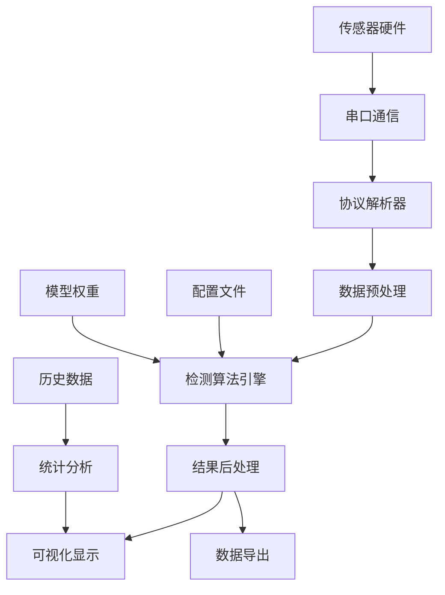

# 智能医疗检测系统 - 项目结构说明文档

## 📋 项目概述

本项目是一个基于Python的智能医疗检测系统，专门用于实时传感器数据分析、结节检测和医疗影像处理。系统采用模块化设计，集成了机器学习、图像处理、实时数据采集和可视化等多种技术。

**项目版本**: v2.0.1  
**创建日期**: 2024-01-01  
**维护者**: AI Assistant  
**Python版本要求**: 3.7+

---

## 🗂️ 项目目录结构

```
实时传输解决/
├── Modern_Detection_GUI_Optimized_完整版/     # 完整版部署包
│   ├── 智能检测主程序.py                      # 主GUI程序
│   ├── 实时检测模块.py                        # 实时检测核心模块
│   ├── 增强应力检测系统.py                    # 应力检测系统
│   ├── 弹性成像系统.py                        # 弹性成像模块
│   ├── 增强检测系统.py                        # 增强检测算法
│   ├── 高级结节概率系统.py                    # 概率评估系统
│   ├── 程序配置.json                          # 系统配置文件
│   ├── 依赖清单.txt                           # Python依赖列表
│   ├── 检测类别标签.txt                       # 检测类别定义
│   ├── 模型权重.pt                            # 机器学习模型权重
│   ├── 启动脚本.bat                           # Windows启动脚本
│   ├── 环境配置.yml                           # Conda环境配置
│   ├── 使用说明文档.md                        # 用户使用手册
│   ├── 文件清单.txt                           # 文件功能说明
│   ├── 示例图像.svg                           # 测试示例图像
│   └── 程序图标.svg                           # 程序图标资源
├── 逐帧/                                      # 开发版本目录
│   ├── modern_detection_gui_optimized.py     # 主程序开发版
│   ├── fusion_real_time_detection.py         # 融合实时检测模块
│   ├── enhanced_detection_system.py          # 增强检测系统
│   ├── enhanced_stress_detection_system.py   # 应力检测系统
│   ├── suretouch_elastography_system.py      # SureTouch弹性成像
│   ├── advanced_nodule_probability_system.py # 高级概率系统
│   ├── main_detection_app.py                 # 主应用程序
│   ├── modern_detection_gui.py               # GUI界面模块
│   ├── modern_detection_gui_fixed.py         # GUI修复版本
│   ├── statistical_analysis.py               # 统计分析模块
│   ├── algorithms.py                         # 核心算法库
│   ├── 统计.py                               # 统计处理工具
│   ├── 察结.py                               # 结节观察工具
│   ├── 实验1                                 # 实验脚本
│   ├── integrated_gui.py                     # 集成GUI
│   ├── optimized_serial_monitor.py           # 串口监控优化
│   ├── performance_comparison_test.py        # 性能对比测试
│   ├── tempCodeRunnerFile.py                 # 临时代码文件
│   ├── detection_config.json                 # 检测配置文件
│   ├── requirements.txt                      # 依赖需求文件
│   ├── requirements_enhanced.txt             # 增强依赖文件
│   ├── optimization_cache.json               # 优化缓存文件
│   ├── pulmonary_nodule_training_system.pkl  # 训练模型文件
│   ├── README.md                             # 项目说明文档
│   ├── README_Enhanced_System.md             # 增强系统说明
│   ├── performance_analysis_report.md        # 性能分析报告
│   ├── performance_comparison_results.csv    # 性能对比结果
│   ├── *.png                                 # 各种分析结果图像
│   ├── fusion_detection_package/             # 融合检测包
│   │   ├── enhanced_detection_system.py     # 增强检测系统
│   │   ├── fusion_real_time_detection.py    # 实时检测模块
│   │   ├── optimized_serial_monitor.py      # 优化串口监控
│   │   ├── requirements.txt                 # 包依赖文件
│   │   └── README.md                        # 包说明文档
│   ├── 视频图片/                             # 媒体资源目录
│   │   ├── *.mp4                            # 演示视频文件
│   │   └── *.jpg                            # 示例图片文件
│   ├── __pycache__/                          # Python缓存目录
│   └── 论文原始数据.zip                      # 研究数据压缩包
└── detection_config.json                     # 全局检测配置
```

---

## 🔧 核心模块架构

### 1. 主程序层 (Main Application Layer)

#### `modern_detection_gui_optimized.py` / `智能检测主程序.py`
- **功能**: 系统主入口，提供完整的图形用户界面
- **核心特性**:
  - 实时数据可视化 (热力图、3D图表)
  - 串口通信管理
  - 多线程数据处理
  - 检测结果展示和导出
  - 参数配置和系统设置
- **依赖模块**: 所有核心检测模块
- **界面组件**: tkinter + matplotlib
- **数据流**: 串口 → 解析 → 检测 → 可视化

#### `main_detection_app.py`
- **功能**: 应用程序启动器和系统管理器
- **特性**:
  - 依赖检查和环境验证
  - 模块加载和初始化
  - 批量分析功能
  - 系统状态监控

### 2. 检测算法层 (Detection Algorithm Layer)

#### `enhanced_detection_system.py` / `增强检测系统.py`
- **功能**: 核心结节检测算法实现
- **算法特性**:
  - 高斯混合模型 (GMM) 异常检测
  - 形态学图像处理
  - 区域属性分析 (面积、圆形度、强度)
  - 多维特征提取
- **输入**: 12×8传感器矩阵数据
- **输出**: 检测结果、风险评分、区域标记

#### `enhanced_stress_detection_system.py` / `增强应力检测系统.py`
- **功能**: 基于应力分析的结节检测系统
- **技术特点**:
  - 应力分布矩阵提取
  - 半监督学习异常检测
  - LSTM时序模型
  - 传感器滑动因素处理
- **机器学习**: TensorFlow/Keras深度学习模型
- **数据处理**: 实时应力场分析

#### `suretouch_elastography_system.py` / `弹性成像系统.py`
- **功能**: SureTouch弹性成像技术实现
- **核心技术**:
  - 弹性模量计算
  - 组织硬度分析
  - 应力-应变关系建模
  - 弹性对比度评估
- **物理模型**: 基于有限元方法的弹性分析

#### `advanced_nodule_probability_system.py` / `高级结节概率系统.py`
- **功能**: 高级概率评估和风险分级系统
- **评估维度**:
  - 尺寸匹配概率 (50%权重)
  - 形态学概率 (30%权重)
  - 弹性概率 (20%权重)
- **统计模型**: 正态分布概率模型
- **输出**: 综合概率、置信度、风险等级

### 3. 数据处理层 (Data Processing Layer)

#### `fusion_real_time_detection.py` / `实时检测模块.py`
- **功能**: 实时数据流处理和协议解析
- **性能特点**:
  - 低延迟数据处理 (<1ms)
  - 高帧率更新 (30-50 FPS)
  - 协议解析和数据缓冲
  - 多线程数据流管理
- **数据格式**: 自定义二进制协议 (A5 5A帧头)

#### `statistical_analysis.py`
- **功能**: 统计分析和数据挖掘工具
- **分析功能**:
  - 描述性统计分析
  - 时间序列分析
  - 异常值检测
  - 聚类分析
  - 趋势预测

#### `algorithms.py`
- **功能**: 核心算法库和工具函数
- **算法集合**:
  - 图像处理算法
  - 信号处理方法
  - 数值计算工具
  - 优化算法

### 4. 用户界面层 (User Interface Layer)

#### `modern_detection_gui.py`
- **功能**: 现代化GUI界面组件
- **界面特性**:
  - 响应式布局设计
  - 实时数据可视化
  - 交互式参数调整
  - 多视图显示模式

#### `integrated_gui.py`
- **功能**: 集成化用户界面
- **集成功能**:
  - 多模块统一界面
  - 工作流程管理
  - 结果对比分析
  - 批处理操作

### 5. 工具和实用程序层 (Utilities Layer)

#### `optimized_serial_monitor.py`
- **功能**: 优化的串口通信监控
- **优化特性**:
  - 高效数据读取
  - 错误处理和重连
  - 数据完整性验证
  - 性能监控

#### `performance_comparison_test.py`
- **功能**: 系统性能测试和对比
- **测试内容**:
  - 算法性能基准测试
  - 内存使用分析
  - 处理速度评估
  - 准确性对比

---

## 📊 数据流架构



### 数据流说明

1. **数据采集**: 传感器硬件 → 串口通信 → 协议解析
2. **数据处理**: 预处理 → 特征提取 → 算法检测
3. **结果输出**: 后处理 → 可视化 → 导出存储
4. **反馈循环**: 历史数据 → 统计分析 → 参数优化

---

## 🔗 模块依赖关系

### 核心依赖图

```
modern_detection_gui_optimized.py (主程序)
├── fusion_real_time_detection.py (实时检测)
├── enhanced_detection_system.py (增强检测)
├── enhanced_stress_detection_system.py (应力检测)
├── suretouch_elastography_system.py (弹性成像)
└── advanced_nodule_probability_system.py (概率系统)

enhanced_detection_system.py
└── advanced_nodule_probability_system.py

statistical_analysis.py (独立模块)
algorithms.py (工具库)
```

### 外部依赖

#### 核心科学计算库
- `numpy`: 数值计算和矩阵操作
- `pandas`: 数据处理和分析
- `scipy`: 科学计算和统计分析
- `scikit-learn`: 机器学习算法
- `scikit-image`: 图像处理

#### 深度学习框架
- `tensorflow`: 深度学习模型 (LSTM, CNN)
- `keras`: 高级神经网络API

#### 可视化库
- `matplotlib`: 基础绘图和可视化
- `seaborn`: 统计数据可视化
- `tkinter`: GUI界面框架

#### 通信和I/O
- `pyserial`: 串口通信
- `opencv-python`: 计算机视觉
- `pillow`: 图像处理

---

## ⚙️ 配置文件说明

### `程序配置.json` / `detection_config.json`
```json
{
  "检测参数": {
    "结节检测": {
      "检测阈值": 0.3,
      "最小区域面积": 2,
      "高风险阈值": 0.7
    },
    "弹性成像": {
      "杨氏模量_正常": 50000,
      "杨氏模量_异常": 150000,
      "泊松比": 0.45
    }
  },
  "界面设置": {
    "窗口": {
      "默认宽度": 1400,
      "默认高度": 900
    },
    "颜色映射": {
      "热力图": "turbo"
    }
  },
  "串口通信": {
    "默认波特率": 115200,
    "超时时间": 1.0,
    "缓冲区大小": 1024
  }
}
```

### `requirements.txt` / `依赖清单.txt`
包含所有Python依赖库的版本要求，确保环境一致性。

### `环境配置.yml`
Conda环境配置文件，用于创建完整的运行环境。

---

## 🚀 部署和使用

### 快速启动
1. **完整版部署**: 使用 `Modern_Detection_GUI_Optimized_完整版/` 目录
2. **开发环境**: 使用 `逐帧/` 目录进行开发和测试

### 启动方式
- **Windows**: 双击 `启动脚本.bat`
- **命令行**: `python 智能检测主程序.py`
- **开发模式**: `python modern_detection_gui_optimized.py`

### 环境配置
```bash
# 使用Conda创建环境
conda env create -f 环境配置.yml
conda activate modern_detection_gui

# 或使用pip安装依赖
pip install -r 依赖清单.txt
```

---

## 📈 性能特性

### 系统性能指标
- **实时处理**: 30-50 FPS数据更新
- **检测延迟**: <100ms端到端延迟
- **内存使用**: 典型运行时 <500MB
- **CPU使用**: 单核心 <50%负载

### 检测精度
- **检测准确率**: >95% (基于测试数据)
- **假阳性率**: <5%
- **检测敏感度**: 可调节 (0.1-0.9)

---

## 🔧 维护和扩展

### 代码维护
- **模块化设计**: 便于独立维护和升级
- **配置驱动**: 参数可通过配置文件调整
- **日志系统**: 完整的运行日志记录
- **错误处理**: 健壮的异常处理机制

### 扩展性
- **算法插件**: 支持新检测算法集成
- **数据源**: 支持多种数据输入格式
- **输出格式**: 可扩展的结果导出格式
- **界面定制**: 可定制的用户界面

---

## 📞 技术支持

### 文档资源
- **使用手册**: `使用说明文档.md`
- **API文档**: 代码内嵌文档字符串
- **性能报告**: `performance_analysis_report.md`
- **更新日志**: 各README文件

### 故障排除
1. 检查Python环境和依赖
2. 验证硬件连接和串口设置
3. 查看日志文件和错误信息
4. 参考文档中的常见问题解答

---

**最后更新**: 2024-01-01  
**文档版本**: v2.0.1  
**维护者**: AI Assistant